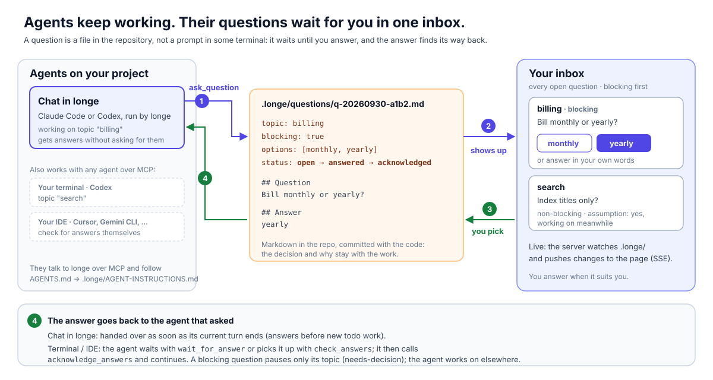

# How messages and the inbox work

longe connects the work you ask for, the decisions an agent needs, and the answers that let it
continue. You get one inbox across repositories. Each repository keeps its own topics, chat
and record of what happened.

The diagram is plain SVG ([source](assets/architecture.svg)); see [assets/README.md](assets/README.md)
for a PNG export.

## One task, from request to review

Suppose you ask an agent to add a settings screen.

1. **You send the request.** A Chat message is saved before delivery to the agent. A message
   from a topic page carries that topic's context. You can also queue a topic as todo.
2. **The agent tracks the work.** The topic holds its goal, plan, decisions and log. If the
   agent needs input, it calls `ask_question` with the question, context and options.
3. **You decide in the inbox.** For example: “Should these settings apply to this project or
   all projects?” Choose an option, add a note, or write a different answer. The question and
   answer live together in one file.
4. **The agent receives the answer.** In the managed chat, longe waits until the current turn
   ends and sends new answers together. The agent calls `check_answers`, reads them, then
   calls `acknowledge_answers` and continues the affected topics.
5. **You review the result.** The agent records its changes and validation on the topic and
   moves it to review. You approve or send it back with feedback. Agents cannot approve
   their own work.

The topic tells you what happened; the inbox tells you what needs your attention.

## Two ways to ask

| Question | What the agent does | What you see |
| --- | --- | --- |
| **Blocking** — cannot proceed without your answer | Stops work on that topic; may work on another | The active topic moves to **needs-decision**; blocking questions appear first |
| **Non-blocking** — a reasonable default exists | States an **assumption** and continues on it | A question you can answer while work continues |

A suggested option is not consent: it is only a choice until you submit an answer. A topic
waiting on several blocking questions returns to active only after the last one is answered
or withdrawn. A project-wide question can appear in the inbox without belonging to a topic.

Review questions can also name approval and rejection options. Choosing an approval option
moves a topic in review to done; choosing a rejection option returns it to active with your
feedback. This makes review part of the same inbox loop.

## Sent, answered, read

Messages and questions have different jobs:

| Record | Meaning | Location |
| --- | --- | --- |
| **Message** | A request from you, or a board-generated notice sent to the chat | `.longe/messages/` |
| **Question + answer** | A decision requested by an agent, your response, and whether it has been read | `.longe/questions/` |
| **Topic** | The goal, plan, decisions, log and current work status | `.longe/topics/` |

A question moves through **open → answered → acknowledged**. Answering saves your response;
acknowledging records that the agent has read it. Until then it remains available through
`check_answers`, and the board shows “answer waiting.” Acknowledgment does not mean the work
is finished. An agent can also withdraw an open question, with a reason, when it is no longer
needed.

The managed chat gives unread answers priority over new todo work. It sends them only while
the chat is free and has a session to receive them. When no topic is active, it can hand the
agent the next todo topic. Backlog stays parked until you choose to queue or activate it.

External agents use the same question files through MCP, REST or direct edits, but need to
check for answers themselves, wait with `wait_for_answer`, or use a configured integration.
If `hooks.on_answer` is configured, that hook handles answer wake-ups instead of the managed
chat's automatic answer delivery. Merely connecting an external agent over MCP does not give
it automatic push delivery.

## What survives a restart

Requests, questions, answers and topic records are markdown files. The UI watches those files;
they are the source of truth, not a separate database. You can inspect them, edit them and
commit them with the code. Unacknowledged answers remain available after restarting longe.

The live assistant transcript is a runtime view. Chat message files store what you or the
board sent to the agent; they are not a complete archive of its streamed replies. The agent
must put lasting results in the topic's **Log** and **Decisions**. Provider session references
are cached separately so the chat can resume.

A message's `delivered_at` field is delivery bookkeeping, not proof that the agent completed
the request. It is not an exactly-once execution guarantee. The topic's progress and your
review determine whether the work is complete.

## Where the logic lives

| Responsibility | Implementation |
| --- | --- |
| Save messages and mark delivery | [messages.ts](../src/store/messages.ts) |
| Deliver chat messages and resume provider sessions | [agent.ts](../src/app/agent.ts) |
| Send unread answers before todo work | [todo-queue.ts](../src/app/todo-queue.ts) |
| Answer, acknowledge or withdraw a question | [question-ops.ts](../src/domain/question-ops.ts) |
| Block, unblock, approve or return a topic | [side-effects.ts](../src/domain/side-effects.ts) |
| Apply effects of tool calls and watched file changes | [effects.ts](../src/index/effects.ts) |

[Back to the README](../README.md) · [Agent protocol](../src/domain/agent-instructions.ts)
